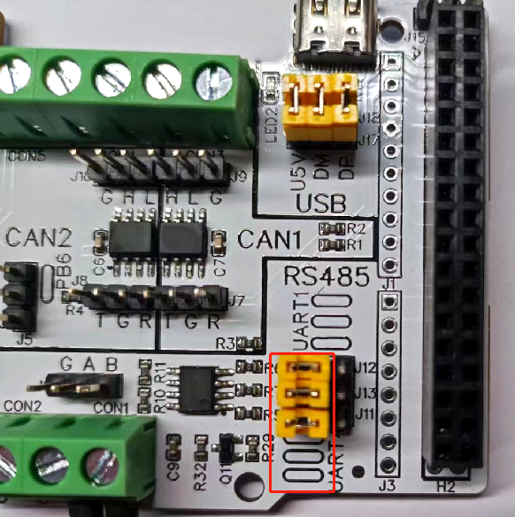
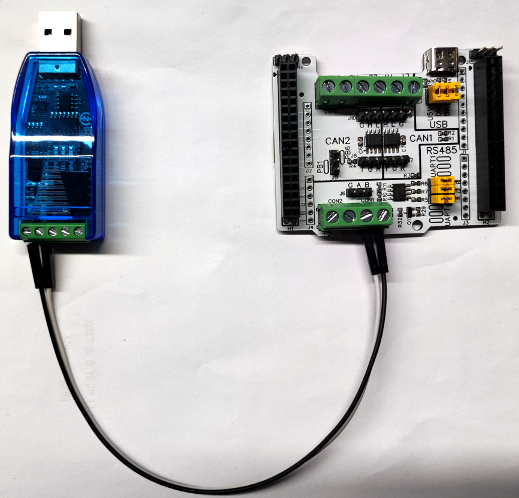
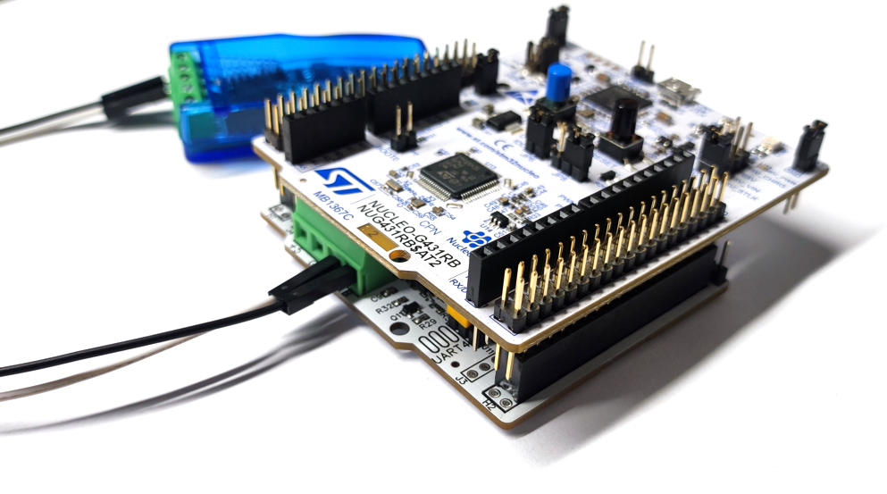
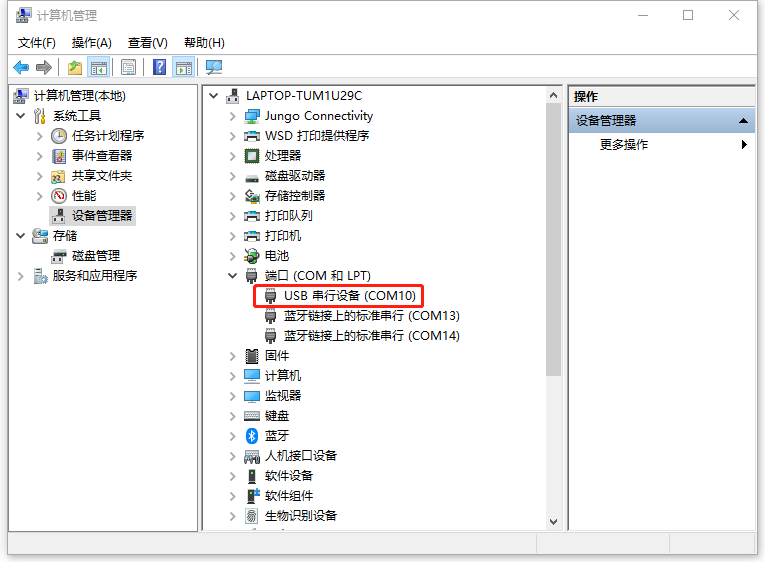
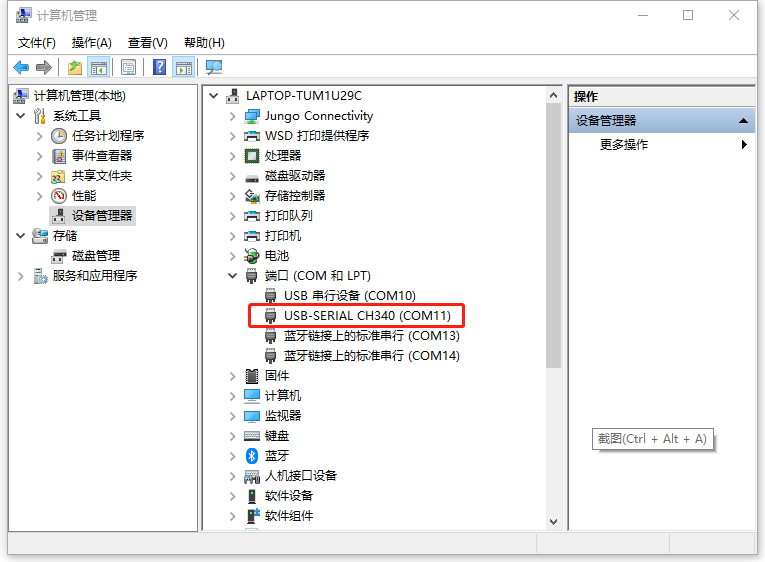
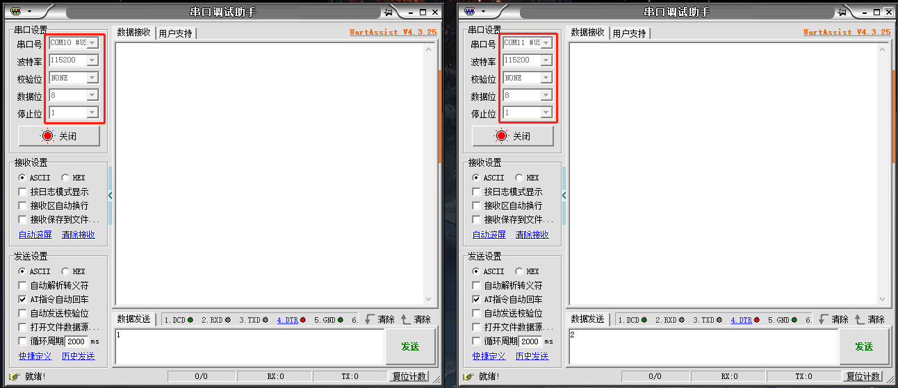
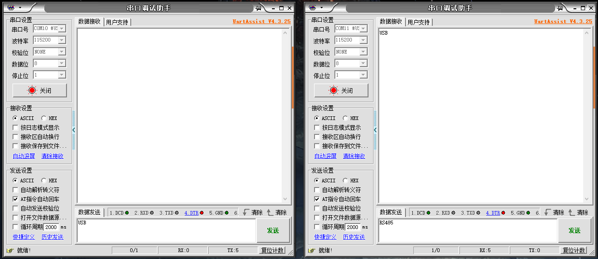
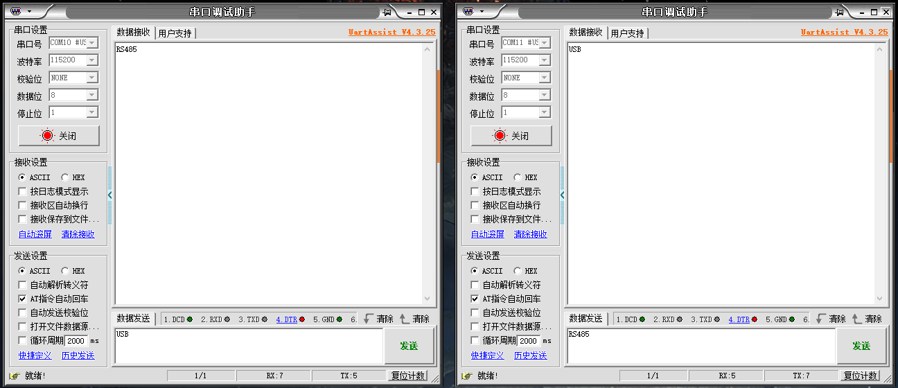

# MAS101 USB2RS485 STEP BY STEP  

## 1 Create & config a new project  
### 1.1 Create a new project  
1.1.1 File > New > STM32 Project  
1.1.2 Board Selector > Part Number (input your board number) > Next  
 

1.1.3 Project Name (USB2RS485) > Finish > Yes (Initialize peripherals)  
 
 

### 1.2 Config USB CDC device  
1.2.1 Pinout & Configuration > Connectivity > USB  
* Enable "Device (FS)"  
 

1.2.2 Pinout & Configuration > Middleware > USB_DEVICE  
* Select "Communication Device Class" from "Class For FS IP"  
 

### 1.3 Config RS485  
1.3.1 Pinout & Configuration > Connectivity > UART4  
* Select "Asynchronous" from "Mode"  
* Enable "Hardware Flow Control (RS485)  
 

### 1.4 Save & close configuration  
***

## 2 Modify code  
### 2.1 usbd_cdc_if.c  
* Modify function "CDC_Receive_FS"
```C
 //CODE BEGIN
 extern UART_HandleTypeDef huart4;
 //CODE END
 
 static int8_t CDC_Receive_FS(uint8_t *Buf, uint32_t *Len) {
 /* USER CODE BEGIN 6 */
   USBD_CDC_SetRxBuffer(&hUsbDeviceFS, &Buf[0]);
   USBD_CDC_ReceivePacket(&hUsbDeviceFS);
 
 //CODE BEGIN
   HAL_UART_Transmit(&huart4, Buf, *Len, 100);
 //CODE END
 
   return (USBD_OK);
 /* USER CODE END 6 */
 }
```

### 2.2 main.c
* Modify function "main"
```C
//CODE BEGIN
uint8_t buf[1024];
uint16_t size;
//CODE END

int main(void) {
...
...
	while (1) {
		/* USER CODE END WHILE */

		/* USER CODE BEGIN 3 */

//CODE BEGIN
		HAL_UART_Receive(&huart4, buf, 1024, 100);
		size = huart4.RxXferSize - huart4.RxXferCount;
		if (size > 0)
			CDC_Transmit_FS(buf, size);
//CODE END

	}
	/* USER CODE END 3 */
}
```
***

## 3 Config & connect hardware  
### 3.1 J11 / J12 / J13 jump to "UART4"  
 

### 3.2 CON1 A / B connect to an RS485 device  
* Use a dedicated USB to RS485 device 
 

### 3.3 Plug MAS101 to NUCLEO  
 

***

## 4 Run
### 4.1 Plug micro USB to NUCLEO & flash the modified code

### 4.2 Unplug micro USB & plug type C to MAS101
* A new COM port appears
 

### 4.3 Plug the dedicated USB to RS485 device
* Another COM port appears
 

### 4.4 Open 2 UART tools & send / receive data
 
 
 
