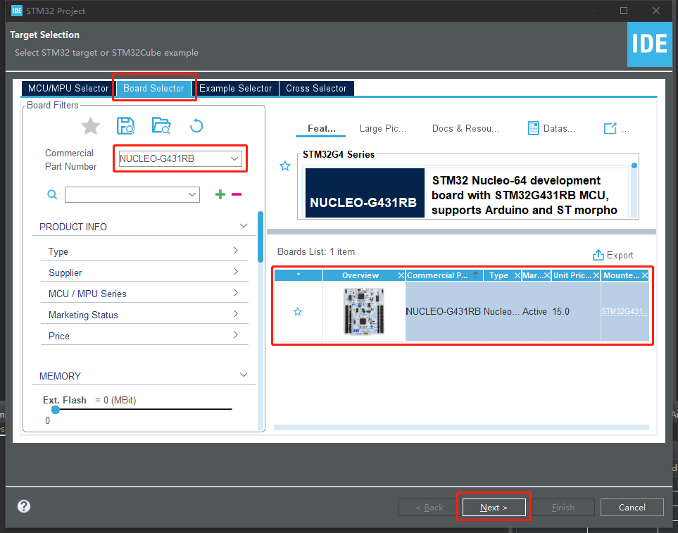
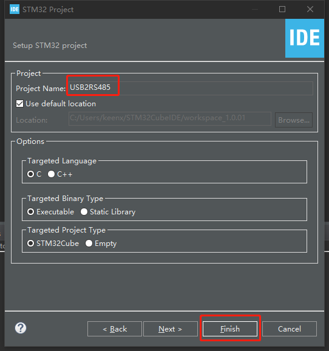
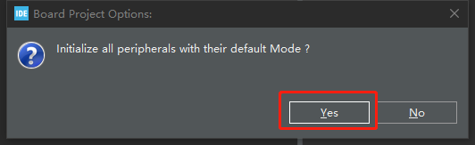
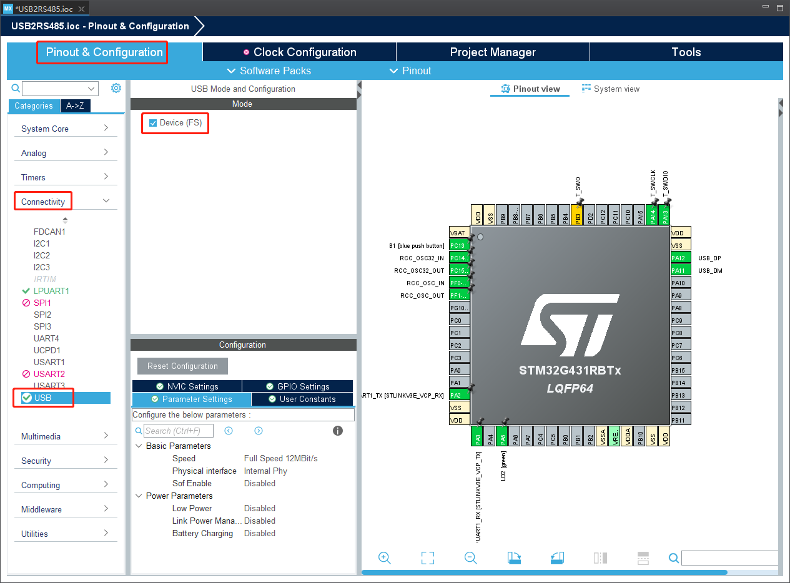
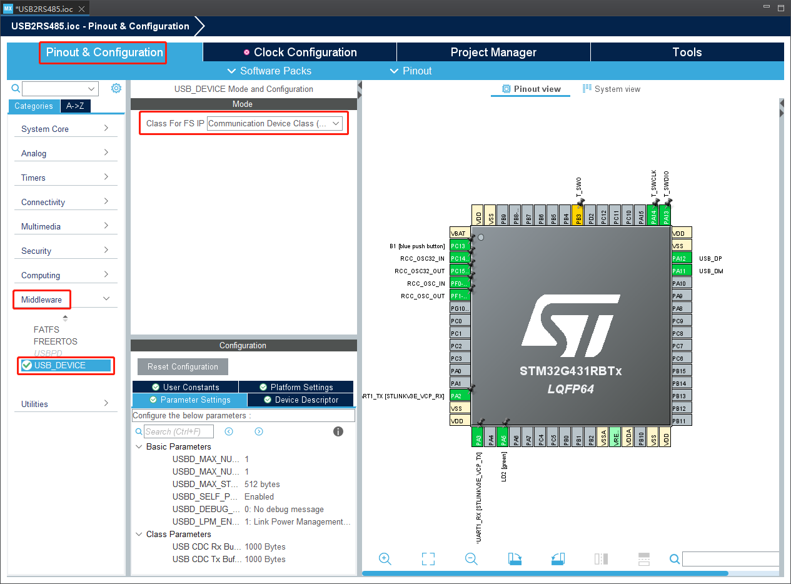
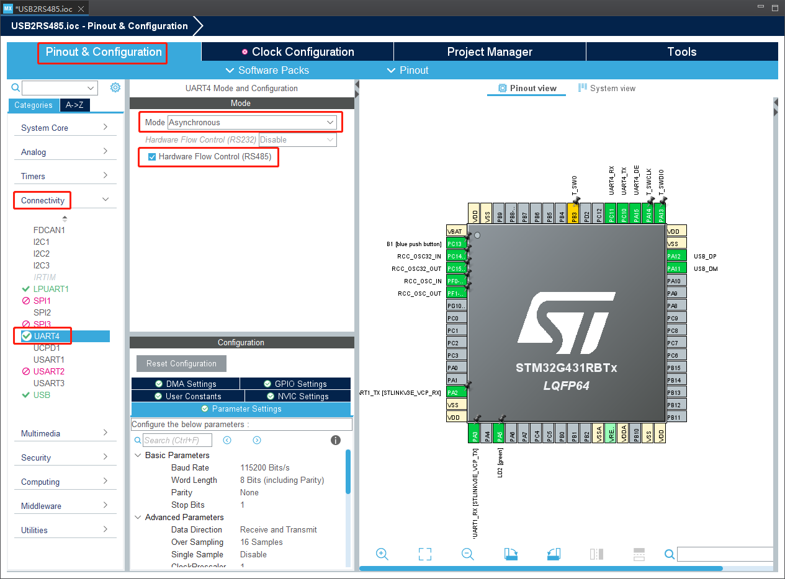

# MAS101 USB2RS485 STEP BY STEP  

## 1 Create & config a new project  
### 1.1 Create a new project  
1.1.1 File > New > STM32 Project  
1.1.2 Board Selector > Part Number (input your board number) > Next  
 

1.1.3 Project Name (USB2RS485) > Finish > Yes (Initialize peripherals)  
 
 

### 1.2 Config USB CDC device  
1.2.1 Pinout & Configuration > Connectivity > USB  
* Enable "Device (FS)"  
 

1.2.2 Pinout & Configuration > Middleware > USB_DEVICE  
* Select "Communication Device Class" from "Class For FS IP"  
 

### 1.3 Config RS485  
1.3.1 Pinout & Configuration > Connectivity > UART4  
* Select "Asynchronous" from "Mode"  
* Enable "Hardware Flow Control (RS485)  
 

### 1.4 Save & close configuration  

## 2 Modify code  
### 2.1 usbd_cdc_if.c  
* Modify function "CDC_Receive_FS"

`  //CODE BEGIN
`  extern UART_HandleTypeDef huart4;
`  //CODE END
`  
`  static int8_t CDC_Receive_FS(uint8_t *Buf, uint32_t *Len) {
`  /* USER CODE BEGIN 6 */
`    USBD_CDC_SetRxBuffer(&hUsbDeviceFS, &Buf[0]);
`    USBD_CDC_ReceivePacket(&hUsbDeviceFS);
`  
`  //CODE BEGIN
`    HAL_UART_Transmit(&huart4, Buf, *Len, 100);
`  //CODE END
`  
`    return (USBD_OK);
`  /* USER CODE END 6 */
`  }