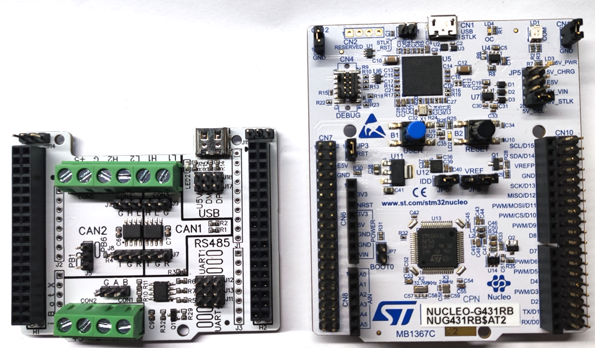
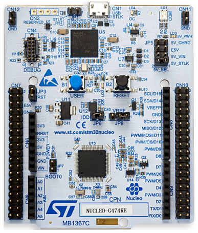
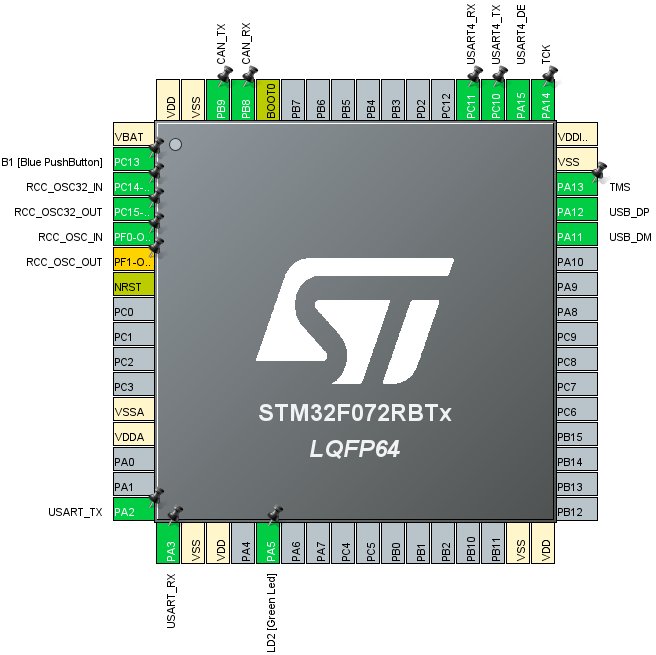

# MAS101

#### 介绍
MORPHO & ARDUINO shields
COMM (USB/RS485/CAN)

适用于 ST NUCLEO-64 开发板

#### 说明
1. NUCLEO-F072RB

1.1 USB
		DP: PA12
		DM: PA11

1.2 RS485 (USART4)
		TX: PC10
		RX: PC11
		DE: PA15
		
1.3 CAN
		TX: PB9
		RX: PB8		

#### 资源
1.  原理图/PCB [[link]](https://gitee.com/ibotx/mas/tree/master/MAS101/HW/V1.0)

