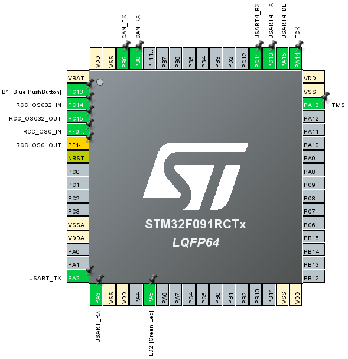
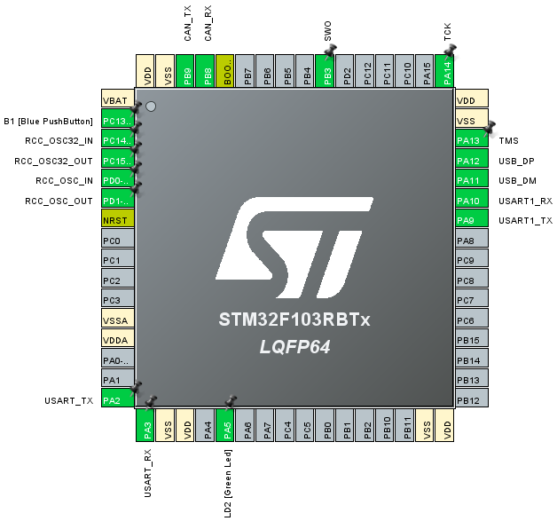
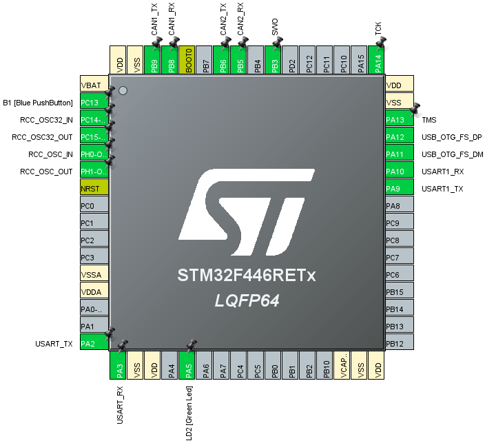
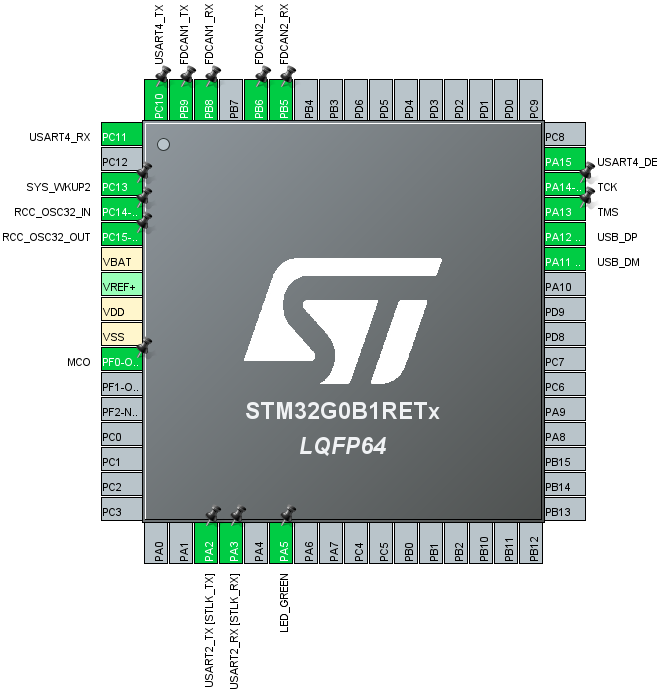
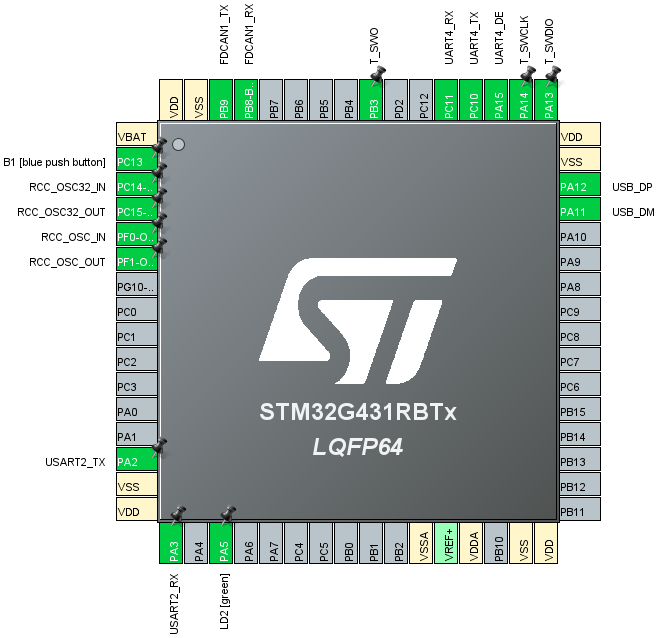
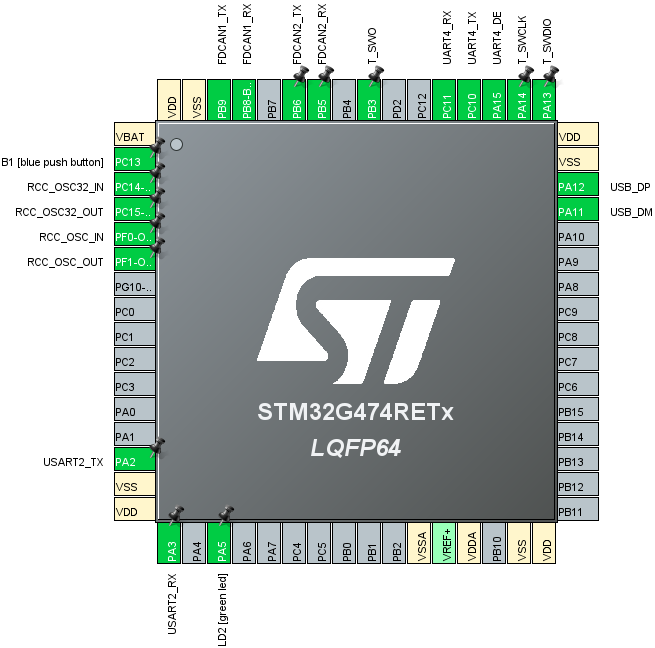

# MAS101

## 介绍
MORPHO & ARDUINO shields COMM (USB/RS485/CAN)，适用于 ST NUCLEO-64 开发板

***
## 硬件配置
### 1. NUCLEO-F072RB 
1.1 USB  
* DP: PA12  
* DM: PA11  

1.2 RS485 (USART4)  
* TX: PC10  
* RX: PC11  
* DE: PA15  
		
1.3 CAN  
* TX: PB9  
* RX: PB8  
		

***
### 2. NUCLEO-F091RC 
2.1 USB
* N/A

2.2 RS485 (USART4)
* TX: PC10
* RX: PC11
* DE: PA15
		
2.3 CAN
* TX: PB9
* RX: PB8
		

***
### 3. NUCLEO-F103RB 
3.1 USB  
* DP: PA12  
* DM: PA11  

3.2 RS485 (USART1)  
* TX: PA9  
* RX: PA10  
* DE: Simulate DE with TX 
		
3.3 CAN  
* TX: PB9  
* RX: PB8  
		

***
### 4. NUCLEO-F466RE
4.1 USB  
* DP: PA12  
* DM: PA11  

4.2 RS485 (USART1)  
* TX: PA9  
* RX: PA10  
* DE: Simulate DE with TX 
		
4.3 CAN  
* TX: PB9  
* RX: PB8  
		
4.3 CAN2  
* TX: PB6  
* RX: PB5  
		

***
### 5. NUCLEO-G0B1RE
5.1 USB  
* DP: PA12  
* DM: PA11  

5.2 RS485 (USART4)
* TX: PC10
* RX: PC11
* DE: PA15  
		
5.3 CAN  
* TX: PB9  
* RX: PB8  
		
5.3 CAN2  
* TX: PB6  ___(TX pin position is NOT default, change J5)___
* RX: PB5  

***
### 6. NUCLEO-G431RB
6.1 USB  
* DP: PA12  
* DM: PA11  

6.2 RS485 (USART4)
* TX: PC10
* RX: PC11
* DE: PA15  
		
6.3 CAN  
* TX: PB9  
* RX: PB8  

***
### 7. NUCLEO-G474RE / NUCLEO-G491RE
7.1 USB  
* DP: PA12  
* DM: PA11  

7.2 RS485 (USART4)
* TX: PC10
* RX: PC11
* DE: PA15  
		
7.3 CAN  
* TX: PB9  
* RX: PB8  
		
7.3 CAN2  
* TX: PB6  
* RX: PB5  

***

## 硬件资源
### 1.  原理图/PCB [[link]](https://gitee.com/ibotx/mas/tree/master/MAS101/HW/V1.0)
***

## 软件资源 （Examples）
###  USB2RS485[[link]](https://gitee.com/ibotx/mas/tree/master/MAS101/FW/Examples/USB2RS485)