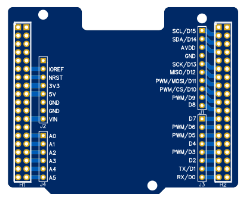
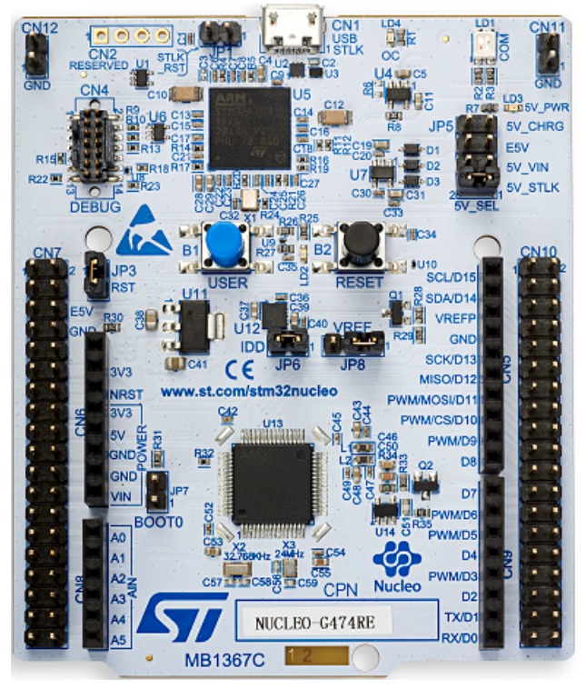

# [MORPHO ARDUINO SHIELDS PROJECT](https://gitee.com/ibotx/mas)  
  

## Introduction
MORPHO & ARDUINO SHIELDS for the ST NUCLEO-64 DEVELOPMENT BOARD

 

## 1.[MAS101](https://gitee.com/ibotx/mas/tree/master/MAS101)
MORPHO & ARDUINO shields COMM (USB/RS485/CAN)  
Communication extensions, include USB x 1 / RS485 x 1 / CAN x 2  
